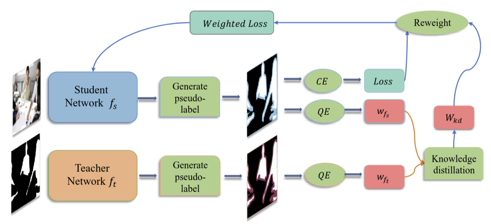

# NLKD

## Abstract
Modern supervised learning relies on a large amount of training data, yet there are many noisy annotations in real datasets. For semantic segmentation tasks, pixel-level annotation noise is typically located at the edge of an object, while pixels within objects are fine-annotated. We argue the coarse annotations can provide instructive supervised information to guide model training rather than be discarded. This paper proposes a noise learning framework based on knowledge distillation NLKD, to improve segmentation performance on unclean data. It utilizes a teacher network to guide the student network that constitutes the knowledge distillation process. The teacher and student generate the pseudo-labels and jointly evaluate the quality of annotations to generate weights for each sample. Experiments demonstrate the effectiveness of NLKD, and we observe better performance with boundary-aware teacher networks and evaluation metrics. Furthermore, the proposed approach is model-independent and easy to implement, appropriate for integration with other tasks and models.


## Prepare the Dataset, Checkpoints and Sample Weight

### 1. Prepare the Dataset, Checkpoints
- Download the Dataset: [link](https://drive.google.com/drive/folders/1BMF8h3ZbzQI4vYu4kiiSPBm8nCBd2Pn2?usp=sharing)
- Add Noise for Supervisely: ref to `utils/add_noise.py` and `utils/generate_noisy_label.py`
- Download the Checkpoints: [link](https://drive.google.com/drive/folders/1BMF8h3ZbzQI4vYu4kiiSPBm8nCBd2Pn2?usp=sharing)


### 2.Prepare the Sample Weight
- Download the Mask from teacher Network: [link](https://drive.google.com/drive/folders/1BMF8h3ZbzQI4vYu4kiiSPBm8nCBd2Pn2?usp=sharing)
- Generate the sample Weight: ref to `utils/get_weight.py`

### 3. Prepare the Environment
- `pip install -r requirements.txt`

## Get Started
ref to `run.sh`

### 1. Ablation Study
```
# train_noisy_60_noweight
python train_without_weight.py --train_csv "data/csv/train_noisy_60.csv" --valid_csv "data/csv/valid_noisy_60.csv" --test_csv "data/csv/test.csv" --name train_noisy_60_noweight --epochs 100 --batch-size 4 --learning-rate 0.1 

# train_noisy_60_miouweight_noKD
python train_with_Teacher_weight.py --train_csv "data/csv/train_noisy_60_PointRend_weight_miouscore.csv" --valid_csv "data/csv/valid_noisy_60.csv" --test_csv "data/csv/test.csv" --name train_noisy_60_miouweight_noKD --epochs 100 --batch-size 4 --learning-rate 0.1

# train_noisy_60_bfweight_noKD
python train_with_Teacher_weight.py --train_csv "data/csv/train_noisy_60_PointRend_weight_bfscore.csv" --valid_csv "data/csv/valid_noisy_60.csv" --test_csv "data/csv/test.csv" --name train_noisy_60_bfweight_noKD --epochs 100 --batch-size 4 --learning-rate 0.1

# train_noisy_60_bmweight_noKD
python train_with_Teacher_weight.py --train_csv "data/csv/train_noisy_60_PointRend_weight_bmscore.csv" --valid_csv "data/csv/valid_noisy_60.csv" --test_csv "data/csv/test.csv" --name train_noisy_60_bmweight_noKD --epochs 100 --batch-size 4 --learning-rate 0.1

# train_noisy_60_miouweight_KD
python train_with_KDweight.py --train_csv "data/csv/train_noisy_60_PointRend_weight_miouscore.csv" --valid_csv "data/csv/valid_noisy_60.csv" --test_csv "data/csv/test.csv" --name train_noisy_60_miouweight_KD --epochs 100 --batch-size 4 --learning-rate 0.1

# train_noisy_60_bfweight_KD
python train_with_KDweight.py --train_csv "data/csv/train_noisy_60_PointRend_weight_bfscore.csv" --valid_csv "data/csv/valid_noisy_60.csv" --test_csv "data/csv/test.csv" --name train_noisy_60_bfweight_KD --epochs 100 --batch-size 4 --learning-rate 0.1

# train_noisy_60_bmweight_KD
python train_with_KDweight.py --train_csv "data/csv/train_noisy_60_PointRend_weight_bmscore.csv" --valid_csv "data/csv/valid_noisy_60.csv" --test_csv "data/csv/test.csv" --name train_noisy_60_bmweight_KD --epochs 100 --batch-size 4 --learning-rate 0.1

```
### 2. Compare with Other Methods

```
# train_noisy_60_decouping
python train_decoupling.py --train_csv "data/csv/train_noisy_60.csv" --valid_csv "data/csv/valid_noisy_60.csv" --test_csv "data/csv/test.csv" --name train_decoupling --epochs 100 --batch-size 4 --learning-rate 0.1

# train_noisy_60_co_teaching
python train_co_teaching.py --train_csv "data/csv/train_noisy_60.csv" --valid_csv "data/csv/valid_noisy_60.csv" --test_csv "data/csv/test.csv" --name train_co_teaching --epochs 100 --batch-size 4 --learning-rate 0.1

# train_noisy_60_co_teaching+
python train_co_teaching+.py --train_csv "data/csv/train_noisy_60.csv" --valid_csv "data/csv/valid_noisy_60.csv" --test_csv "data/csv/test.csv" --name train_co_teaching+ --epochs 100 --batch-size 4 --learning-rate 0.1
```